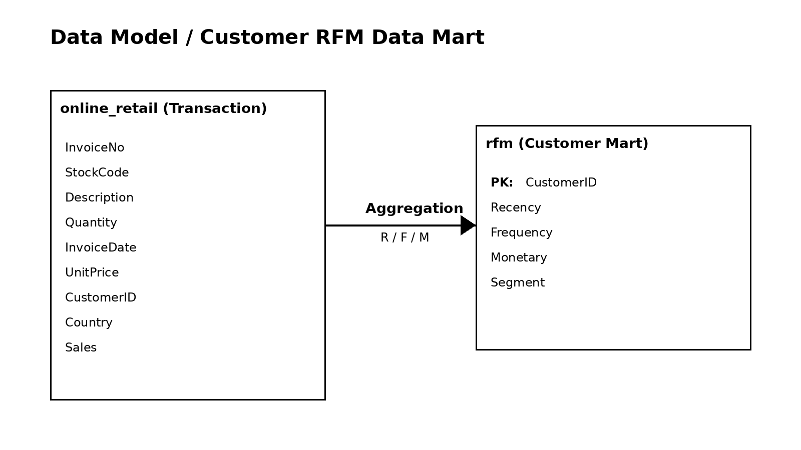

# Online Retail RFM Analysis

## 1. Project Overview
This project analyzes customer purchasing behavior using RFM (Recency, Frequency, Monetary) analysis on the Online Retail dataset.

It implements an end-to-end data pipeline that combines data engineering and analytics workflows, including data cleaning with Python, data loading into MySQL, SQL-based metric validation, and construction of a customer-level data mart.

The project demonstrates the ability to integrate data processing, analytical modeling, and data mart design to generate reproducible, business-oriented insights and identify high-value customer segments.

## 2. Project Flow
Raw CSV → Python Data Cleaning & Exploratory Analysis → MySQL Loading → SQL-based Transformation & Validation → RFM Data Mart Construction → Python/Tableau Visualization

## 3. Data Model & Data Mart Design



This project is designed with a clear separation between transactional data and an analysis-ready customer-level data mart.

Transaction-level data (`online_retail`) is transformed and aggregated into customer-level metrics (R/F/M), which are stored in the `rfm` table.

This structure enables efficient customer segmentation and supports scalable, reproducible analytics workflows.

### Data Model Overview

The data model consists of two main layers:

- **Transaction-level table (`online_retail`)**
  - Stores cleaned transactional data loaded into MySQL
  - Contains detailed information such as `InvoiceNo`, `StockCode`, `Quantity`, `UnitPrice`, `CustomerID`, and `InvoiceDate`

- **Customer-level data mart (`rfm`)**
  - Aggregated table derived from transaction data
  - One row per customer
  - Stores RFM metrics (`Recency`, `Frequency`, `Monetary`) for segmentation and analysis

### Data Mart Design

A customer-centric data mart was designed to support behavioral analysis.

- The `rfm` table serves as a **subject-oriented analytical table**
- Transaction-level data is transformed into customer-level metrics through SQL-based aggregation
- The structure is optimized for analytical queries, visualization, and business insights

### Data Transformation Logic

The transformation from raw data to the data mart includes:

- Data validation:
  - Missing `CustomerID` removed
  - Returned transactions excluded (`Quantity <= 0`)
  - Invalid price records filtered (`UnitPrice <= 0`)
- Feature engineering:
  - `Sales = Quantity × UnitPrice`
- Aggregation:
  - **Recency**: Days since last purchase
  - **Frequency**: Number of distinct orders per customer
  - **Monetary**: Total spending per customer

### Design Rationale

- Raw data is preserved at the transaction level for traceability
- Aggregated data is separated into a dedicated analytical table for performance and clarity
- SQL-based transformation ensures reproducibility and consistency in analytical results
- The data mart structure supports scalable customer segmentation and downstream analytics

## 4. Project Summary

- Built an end-to-end data pipeline combining Python and MySQL
- Performed data cleaning in Python and SQL-based validation and aggregation
- Designed and constructed a customer-level RFM data mart
- Applied RFM analysis to segment customers based on purchasing behavior
- Identified high-value customer groups and generated business insights

## 5. Tech Stack

- **Language**: Python, SQL
- **Data Processing**: Pandas, NumPy
- **Database**: MySQL
- **ORM / Connection**: SQLAlchemy, PyMySQL
- **Visualization**: Matplotlib, Tableau
- **Environment Management**: python-dotenv
- **Notebook**: Jupyter Notebook
- **Development Environment**: VS Code
- **Concepts**: Data Cleaning, Data Transformation, Data Validation, Data Mart Design  

## 6. Dataset
This project uses the Online Retail dataset, which contains transactional records of a UK-based online retail company.

The dataset captures detailed purchase history at the transaction level, making it suitable for customer behavior analysis and RFM-based segmentation.

Key columns include:
- `InvoiceNo`: Order identifier  
- `StockCode`: Product code  
- `Description`: Product name  
- `Quantity`: Number of items purchased  
- `InvoiceDate`: Transaction timestamp  
- `UnitPrice`: Price per item  
- `CustomerID`: Customer identifier  
- `Country`: Customer country  

This dataset enables the calculation of customer-level metrics such as purchase recency, order frequency, and total spending, which are essential for building a customer-level analytical data mart.

## 7. Data Processing Pipeline
The project follows an end-to-end data pipeline from raw data ingestion to analytical data mart construction:

1. Load raw transaction data from CSV  
2. Perform data cleaning and validation using Python  
3. Create a derived `Sales` column (`Quantity * UnitPrice`)  
4. Load the cleaned dataset into MySQL  
5. Apply SQL-based transformation and metric validation  
6. Aggregate transaction-level data into a customer-level RFM data mart (`rfm`)  
7. Perform analysis, segmentation, and visualization in Python and Tableau  

## 8. Data Preprocessing & Transformation

Data processing was performed in two stages using both Python and SQL to ensure data quality and analytical consistency.

### Python (Data Cleaning)
The raw dataset was cleaned before loading into MySQL.

- Converted `InvoiceDate` to datetime format  
- Removed rows with missing `CustomerID`  
- Excluded returned transactions (`Quantity <= 0`)  
- Removed invalid price records (`UnitPrice <= 0`)  
- Converted `CustomerID` to integer type  
- Created a new `Sales` column as `Quantity * UnitPrice`  

The preprocessing logic is implemented in:
- `scripts/preprocess_and_load.py`

After preprocessing, the cleaned dataset was loaded into MySQL.

### SQL (Data Validation & Aggregation)
SQL was used to validate metrics and construct the analytical dataset.

- Reapplied filtering conditions using a CTE (`clean_data`)  
- Validated each RFM metric independently  
- Applied aggregation logic using `GROUP BY`  
- Constructed the final customer-level data mart (`rfm`)  

These steps ensure consistent business logic and improve the reliability of the analysis.

## 9. RFM Analysis (Python & SQL)

Customer-level RFM metrics were calculated using both Python and MySQL.

- **Recency**: Days since the customer's most recent purchase  
- **Frequency**: Number of distinct orders per customer  
- **Monetary**: Total purchase amount per customer  

### Python-based Analysis
- Performed exploratory analysis using Pandas in Jupyter Notebook  
- Applied scoring and segmentation logic for flexible analysis  

### SQL-based Analysis

RFM metrics were calculated in MySQL using a two-step approach:

1. **Metric-level validation**
   - `sql/01_calculate_monetary.sql`: Validates total spending per customer  
   - `sql/02_calculate_frequency.sql`: Validates order count per customer  
   - `sql/03_calculate_recency.sql`: Validates recency based on latest transaction  

2. **Data mart construction**
   - `sql/04_create_rfm_table.sql`: Integrates all metrics and creates the final `rfm` table  

This approach ensures that each metric is independently verified before constructing the final analytical dataset.

## 10. Analysis & Visualization

### Python
Python was used for exploratory analysis and preliminary validation of customer segmentation results.

- Visualized segment distribution to understand customer group proportions  
- Analyzed the distribution of RFM-based segments  
- Performed baseline validation of segmentation logic before dashboard development  


### Tableau
An interactive Tableau dashboard was developed to provide a comprehensive view of customer segmentation and revenue contribution.

The dashboard includes:

- Customer Segment Distribution  
- RFM Scatter Analysis  
- Revenue Contribution by Segment  

Users can interact with filters to explore customer behavior, identify high-value segments, and analyze revenue concentration patterns.


## 11. Results & Insights

Key findings from the analysis include:

- The majority of customers belong to the **Normal** segment, indicating a broad base of average purchasing behavior  
- A small group of **VIP** customers contributes a disproportionately high share of total revenue  
- **Recent** customers show strong potential for retention and targeted engagement  
- **Big Spenders** generate high revenue despite relatively lower purchase frequency  
- Sales are highly concentrated in the **United Kingdom**, suggesting geographic dependency  

These results highlight a strong imbalance in customer value distribution, where a small segment of customers drives a significant portion of revenue.

RFM-based segmentation enables the identification of high-value customers and supports data-driven marketing strategies such as targeted promotions, retention campaigns, and customer prioritization.

## 12. Key Results

- Processed and loaded **397,884** transaction records into MySQL  
- Analyzed **4,338** unique customers  
- Identified a VIP segment comprising only **8.02%** of customers  
- Found that VIP customers contribute **43.82%** of total revenue  
- Confirmed a strong Pareto-like distribution in customer purchasing behavior  

## 13. Project Structure

```bash
online-retail-analysis/
├── data/                 # Raw dataset and exported RFM data
│   ├── online_retail.csv
│   └── rfm_tableau.csv
├── images/               # Visualization outputs (Python analysis & Tableau dashboard)
│   ├── segment_distribution.png
│   ├── dashboard.png
│   └── data_model_erd.png
├── notebooks/            # Exploratory analysis and RFM segmentation
│   └── rfm_analysis.ipynb
├── scripts/              # Python-based data cleaning and loading pipeline
│   └── preprocess_and_load.py
├── sql/                  # SQL queries for metric validation and RFM data mart construction
│   ├── 01_calculate_monetary.sql
│   ├── 02_calculate_frequency.sql
│   ├── 03_calculate_recency.sql
│   └── 04_create_rfm_table.sql
├── tableau/              # Tableau dashboard
│   └── rfm_dashboard.twbx
├── requirements.txt
├── .env.example
├── .gitignore
└── README.md
```

## 14. How to Run

### 1) Clone the repository

```bash
git clone https://github.com/hyunsung6608/online-retail-rfm-analysis.git
cd online-retail-rfm-analysis
```

### 2) Install dependencies

```bash
pip install -r requirements.txt
```

### 3) Prepare MySQL database

Create a database named `retail_project` in MySQL.

```bash
mysql -u your_username -p
```

```sql
CREATE DATABASE retail_project;
```

### 4) Set up environment variables

Create a `.env` file in the project root based on `.env.example`:

```bash
# macOS / Linux
cp .env.example .env

# Windows
copy .env.example .env
```

Then edit the `.env` file:

```env
DB_USER = your_username
DB_PASSWORD = your_password
DB_HOST = localhost
DB_PORT = 3306
DB_NAME = retail_project
```

### 5) Run preprocessing script

```bash
cd scripts
python preprocess_and_load.py
```

Note: This script must be executed from within the `scripts` directory because it uses a relative path.

### 6) Execute SQL files

Run the SQL files in the `sql/` directory in order:

* 01_calculate_monetary.sql
* 02_calculate_frequency.sql
* 03_calculate_recency.sql
* 04_create_rfm_table.sql

### 7) Run Jupyter Notebook

```bash
cd notebooks
jupyter notebook
```

Then open `rfm_analysis.ipynb`.

## 15. Future Improvements

- Enhance RFM segmentation by applying more granular rules (e.g., Champions, At Risk, Hibernating) to improve customer classification  

- Ensure consistency between Python-based and SQL-based RFM calculations to strengthen data validation and reliability  

- Build an automated data pipeline to enable periodic updates of customer segmentation and improve scalability  

- Extend the analytical model by incorporating additional features such as Customer Lifetime Value (CLV) and churn prediction  

- Improve data modeling by introducing additional dimensions (e.g., product or time) to support more advanced analysis