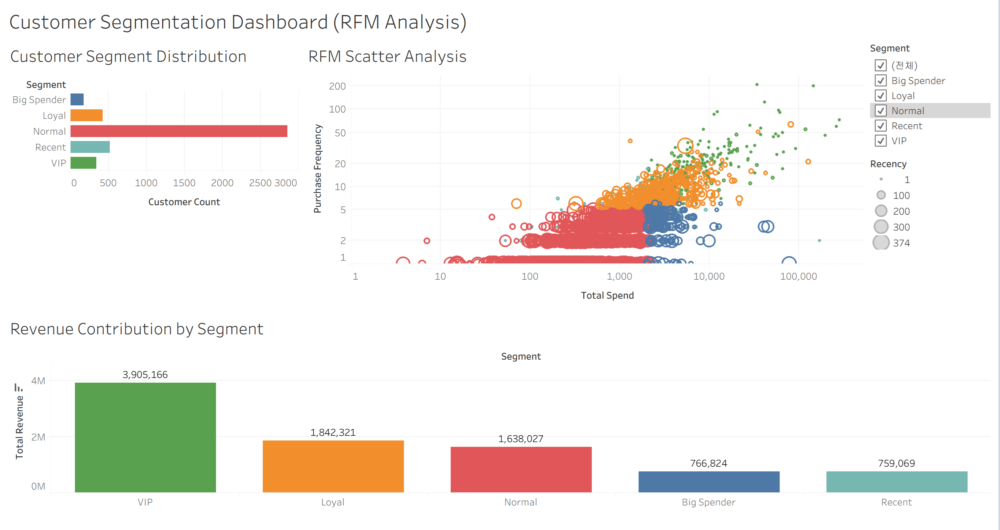

# Online Retail RFM Analysis

## 1. Project Overview
This project analyzes customer purchasing behavior using RFM (Recency, Frequency, Monetary) analysis on the Online Retail dataset.

Built an end-to-end data analytics pipeline that transforms raw transaction data into actionable customer insights using Python, MySQL, and SQL-based RFM analysis.

Demonstrates the ability to identify high-value customer segments and deliver reproducible, data-driven insights from raw transactional data.

## Project Flow
Raw CSV → Python Data Preprocessing & Exploratory Analysis → MySQL Loading → SQL-based RFM Analysis → Python/Tableau Visualization

## 2. Project Summary

- Built an end-to-end data pipeline using Python and MySQL
- Performed RFM analysis to segment customers based on purchasing behavior
- Identified high-value customer groups for business insights

## 3. Tech Stack

- **Language**: Python, SQL
- **Data Processing**: Pandas, NumPy
- **Database**: MySQL
- **ORM / Connection**: SQLAlchemy, PyMySQL
- **Visualization**: Matplotlib, Tableau
- **Environment Management**: python-dotenv
- **Notebook**: Jupyter Notebook
- **Development Environment**: VS Code

## 4. Dataset
This project uses the Online Retail dataset, which contains transactional records of a UK-based online retail company.

Key columns include:
- `InvoiceNo`: Order identifier
- `StockCode`: Product code
- `Description`: Product name
- `Quantity`: Number of items purchased
- `InvoiceDate`: Transaction timestamp
- `UnitPrice`: Price per item
- `CustomerID`: Customer identifier
- `Country`: Customer country

This dataset is suitable for RFM analysis because it contains customer-level purchase history, order frequency, and monetary information.

## 5. Data Processing Pipeline
The project follows an end-to-end workflow:

1. Load raw transaction data from CSV
2. Clean and preprocess data using Python
3. Create a derived `Sales` column (`Quantity * UnitPrice`)
4. Load the cleaned dataset into MySQL
5. Calculate RFM metrics using SQL
6. Build a customer-level RFM table
7. Perform RFM analysis, customer segmentation, and exploratory analysis in Jupyter Notebook

## 6. Data Preprocessing (Python)
The raw dataset was cleaned in Python before loading it into MySQL.

Preprocessing steps:
- Converted `InvoiceDate` to datetime format
- Removed rows with missing `CustomerID`
- Excluded returned transactions (`Quantity <= 0`)
- Removed invalid price records (`UnitPrice <= 0`)
- Converted `CustomerID` to integer type
- Created a new `Sales` column as `Quantity * UnitPrice`

The preprocessing logic is implemented in:
- `scripts/preprocess_and_load.py`

After preprocessing, the cleaned data was loaded into MySQL for SQL-based analysis.

## 7. RFM Analysis (Python & SQL)
Customer-level RFM metrics were calculated using both Python and MySQL.

- **Recency**: Number of days since the customer's most recent purchase
- **Frequency**: Number of distinct orders made by each customer
- **Monetary**: Total purchase amount spent by each customer

### Python-based Analysis
RFM metrics were first computed using Pandas in Jupyter Notebook.  
Customer segmentation was performed by applying scoring and grouping logic, enabling flexible exploratory analysis.

### SQL-based Analysis
RFM metrics were also computed using SQL in MySQL to demonstrate database-level processing and reproducibility.  
The results were stored in an `rfm` table for further use.

SQL files used:
- `sql/01_calculate_monetary.sql`
- `sql/02_calculate_frequency.sql`
- `sql/03_calculate_recency.sql`
- `sql/04_create_rfm_table.sql`

## 8. Analysis & Visualization

### Python
Initial visualization was performed in Python to explore customer segment distribution and summarize RFM-based grouping results.

- Segment distribution visualization
- Exploratory analysis of customer segment counts
- Baseline summary of customer segmentation before dashboard development


### Tableau
An interactive Tableau dashboard was created to provide a more intuitive view of customer segmentation and revenue patterns.

The dashboard includes:
- Customer Segment Distribution
- RFM Scatter Analysis
- Revenue Contribution by Segment

Users can interact with the dashboard using filters to explore customer behavior and identify high-value or at-risk customer groups.



## 9. Results & Insights
Key findings from the analysis include:

- The majority of customers fall into the **Normal** segment
- A smaller group of **VIP** customers contributes disproportionately high purchase value
- **Recent** customers show potential for retention campaigns
- **Big Spender** customers spend large amounts even if their purchase frequency is not the highest
- Sales are heavily concentrated in the **United Kingdom**

These results demonstrate how RFM analysis can be used to identify high-value customers and support targeted marketing strategies.

RFM scoring and segmentation were applied to classify customers into meaningful groups such as VIP, Normal, and Big Spender.

## 10. Key Results

- Processed and loaded **397,884** transaction records into MySQL
- Analyzed **4,338** unique customers
- Identified a VIP segment comprising only **8.02%** of customers
- Found that VIP customers contribute **43.82%** of total revenue
- Revealed a strong Pareto distribution in customer purchasing behavior

## 11. Project Structure

```bash
online-retail-analysis/
├── data/                 # Raw dataset and exported RFM data
│   ├── online_retail.csv
│   └── rfm_tableau.csv
├── images/               # Visualization images
│   ├── segment_distribution.png
│   └── dashboard.png
├── notebooks/            # Jupyter notebooks for analysis
│   └── rfm_analysis.ipynb
├── scripts/              # Data preprocessing and loading scripts
│   └── preprocess_and_load.py
├── sql/                  # SQL queries for RFM calculation
│   ├── 01_calculate_monetary.sql
│   ├── 02_calculate_frequency.sql
│   ├── 03_calculate_recency.sql
│   └── 04_create_rfm_table.sql
├── tableau/              # Tableau dashboard file
│   └── rfm_dashboard.twbx
├── requirements.txt
├── .env.example
├── .gitignore
└── README.md
```

## 12. How to Run

### 1) Clone the repository

```bash
git clone https://github.com/hyunsung6608/online-retail-rfm-analysis.git
cd online-retail-rfm-analysis
```

### 2) Install dependencies

```bash
pip install -r requirements.txt
```

### 3) Prepare MySQL database

Create a database named `retail_project` in MySQL.

```bash
mysql -u your_username -p
```

```sql
CREATE DATABASE retail_project;
```

### 4) Set up environment variables

Create a `.env` file in the project root based on `.env.example`:

```bash
# macOS / Linux
cp .env.example .env

# Windows
copy .env.example .env
```

Then edit the `.env` file:

```env
DB_USER = your_username
DB_PASSWORD = your_password
DB_HOST = localhost
DB_PORT = 3306
DB_NAME = retail_project
```

### 5) Run preprocessing script

```bash
cd scripts
python preprocess_and_load.py
```

Note: This script must be executed from within the `scripts` directory because it uses a relative path.

### 6) Execute SQL files

Run the SQL files in the `sql/` directory in order:

* 01_calculate_monetary.sql
* 02_calculate_frequency.sql
* 03_calculate_recency.sql
* 04_create_rfm_table.sql

### 7) Run Jupyter Notebook

```bash
cd notebooks
jupyter notebook
```

Then open `rfm_analysis.ipynb`.

## 13. Future Improvements

- Implement more detailed RFM segmentation rules (e.g., Champions, At Risk, Hibernating) for more refined customer analysis.

- Validate consistency between Python-based RFM calculations and SQL-based results.

- Build a fully automated data pipeline to regularly update customer segmentation.

- Extend the analysis by incorporating additional features such as customer lifetime value (CLV) or churn prediction.