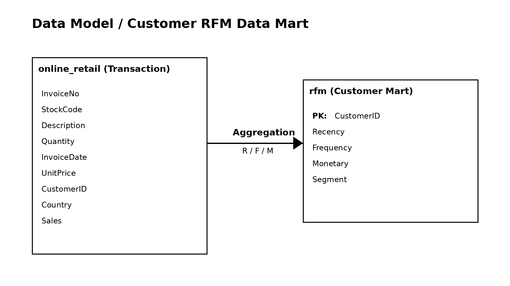
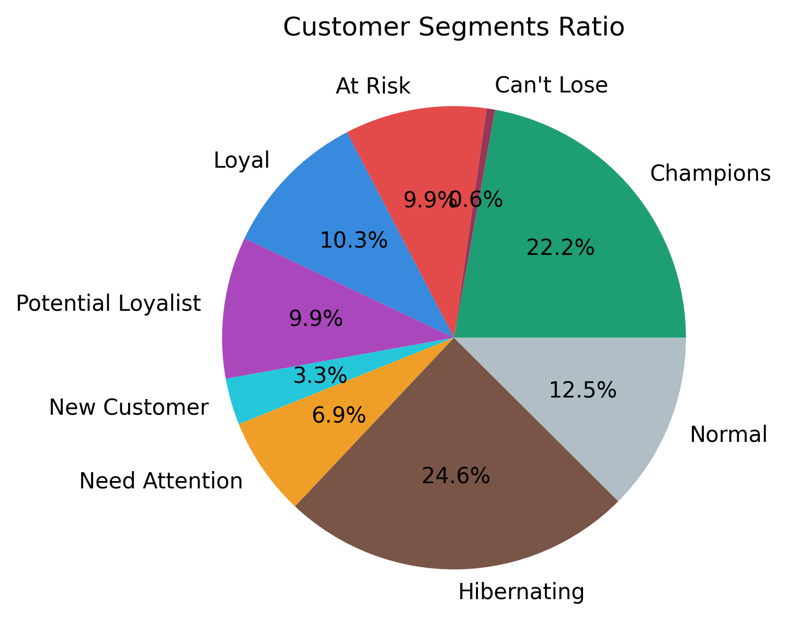
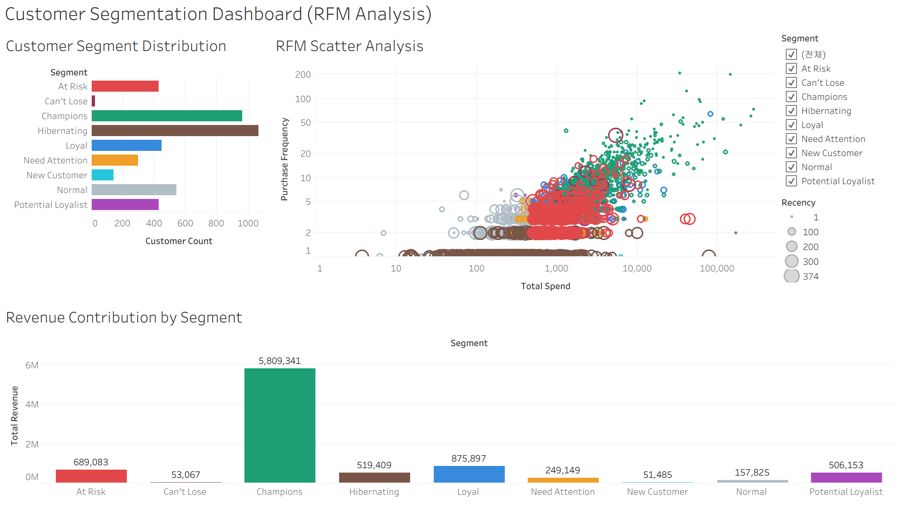

# Online Retail RFM Analysis

## 1. Business Problem

Online retailers often apply a one-size-fits-all marketing approach
despite significant differences in customer value.
A small group of high-value customers drives the majority of revenue —
yet without segmentation, they receive the same treatment as average buyers.

**The core question:**
> "With a limited marketing budget, which customers should receive resources first?"

**Why this matters:**

- Without segmentation, high-value and average customers receive identical marketing — wasting budget
- Losing a single Champions customer has the same revenue impact as losing dozens of average buyers
- Blanket campaigns that ignore behavioral differences lead to lower re-engagement rates
- Revenue concentrated in a single market introduces geographic dependency risk

**What this analysis enables:**

By classifying customers into 9 behavioral groups based on purchasing patterns,
this analysis provides a data-driven foundation for targeted marketing strategies
and prioritized resource allocation toward high-value customers.

---

This project addresses the above problem through RFM (Recency, Frequency, Monetary) analysis,
using an end-to-end pipeline from raw transaction data to an interactive Tableau dashboard.

**Key finding:** The Champions segment (R≥4, F≥4, M≥4) comprises **22.18%** of customers
yet contributes **65.19%** of total revenue —
quantifying exactly why focused investment in top customers matters.

## 2. Key Highlights

- Processed **397,884** transactions and analyzed **4,338** unique customers
- Champions segment (**22.18%** of customers) contributes **65.19%** of total revenue — confirming a strong Pareto-like distribution
- Segmented customers into **9 distinct groups** for precise, actionable targeting
- Built end-to-end pipeline: Python cleaning → MySQL data mart → Tableau dashboard
- Each RFM metric independently validated in SQL before data mart construction
- Applied **log transformation to Monetary** (`log1p`) to reduce outlier distortion in M_score

## 3. Project Flow

Raw CSV → Python Data Cleaning & Exploratory Analysis → MySQL Loading → SQL-based Transformation & Validation → RFM Data Mart Construction → Python/Tableau Visualization

## 4. Data Model & Data Mart Design



This project is designed with a clear separation between transactional data and an analysis-ready customer-level data mart.

Transaction-level data (`online_retail`) is transformed and aggregated into customer-level metrics (R/F/M), which are stored in the `rfm` table.

This structure enables efficient customer segmentation and supports scalable, reproducible analytics workflows.

### Data Model Overview

The data model consists of two main layers:

- **Transaction-level table (`online_retail`)**
  - Stores cleaned transactional data loaded into MySQL
  - Contains detailed information such as `InvoiceNo`, `StockCode`, `Quantity`, `UnitPrice`, `CustomerID`, and `InvoiceDate`

- **Customer-level data mart (`rfm`)**
  - Aggregated table derived from transaction data
  - One row per customer
  - Stores RFM metrics (`Recency`, `Frequency`, `Monetary`) for segmentation and analysis

### Data Mart Design

A customer-centric data mart was designed to support behavioral analysis.

- The `rfm` table serves as a **subject-oriented analytical table**
- Transaction-level data is transformed into customer-level metrics through SQL-based aggregation
- The structure is optimized for analytical queries, visualization, and business insights

### Data Transformation Logic

The transformation from raw data to the data mart includes:

- Data validation:
  - Missing `CustomerID` removed
  - Returned transactions excluded (`Quantity <= 0`)
  - Invalid price records filtered (`UnitPrice <= 0`)
- Feature engineering:
  - `Sales = Quantity × UnitPrice`
- Aggregation:
  - **Recency**: Days since last purchase
  - **Frequency**: Number of distinct orders per customer
  - **Monetary**: Total spending per customer

### Design Rationale

- Raw data is preserved at the transaction level for traceability
- Aggregated data is separated into a dedicated analytical table for performance and clarity
- SQL-based transformation ensures reproducibility and consistency in analytical results
- The data mart structure supports scalable customer segmentation and downstream analytics

## 5. Project Summary

**Problem:** Budget inefficiency from applying uniform marketing regardless of customer value

**Approach:** RFM-based behavioral analysis → 9-segment classification → group-level strategy

**Outcome:**
- Built an end-to-end data pipeline combining Python and MySQL
- Performed data cleaning in Python and SQL-based validation and aggregation
- Designed and constructed a customer-level RFM data mart
- Applied RFM analysis to segment customers into 9 groups based on purchasing behavior
- Identified high-value customer groups and generated actionable business insights

## 6. Tech Stack

- **Language**: Python, SQL
- **Data Processing**: Pandas, NumPy
- **Database**: MySQL
- **ORM / Connection**: SQLAlchemy, PyMySQL
- **Visualization**: Matplotlib, Tableau
- **Environment Management**: python-dotenv
- **Notebook**: Jupyter Notebook
- **Development Environment**: VS Code
- **Concepts**: Data Cleaning, Data Transformation, Data Validation, Data Mart Design

## 7. Dataset

This project uses the Online Retail dataset, which contains transactional records of a UK-based online retail company.

The dataset captures detailed purchase history at the transaction level, making it suitable for customer behavior analysis and RFM-based segmentation.

Key columns include:
- `InvoiceNo`: Order identifier
- `StockCode`: Product code
- `Description`: Product name
- `Quantity`: Number of items purchased
- `InvoiceDate`: Transaction timestamp
- `UnitPrice`: Price per item
- `CustomerID`: Customer identifier
- `Country`: Customer country

This dataset enables the calculation of customer-level metrics such as purchase recency, order frequency, and total spending, which are essential for building a customer-level analytical data mart.

## 8. Data Processing Pipeline

The project follows an end-to-end data pipeline from raw data ingestion to analytical data mart construction:

1. Load raw transaction data from CSV
2. Perform data cleaning and validation using Python
3. Create a derived `Sales` column (`Quantity * UnitPrice`)
4. Load the cleaned dataset into MySQL
5. Apply SQL-based transformation and metric validation
6. Aggregate transaction-level data into a customer-level RFM data mart (`rfm`)
7. Perform analysis, segmentation, and visualization in Python and Tableau

## 9. Data Preprocessing & Transformation

Data processing was performed in two stages using both Python and SQL to ensure data quality and analytical consistency.

### Python (Data Cleaning)

The raw dataset was cleaned before loading into MySQL.

- Converted `InvoiceDate` to datetime format
- Removed rows with missing `CustomerID`
- Excluded returned transactions (`Quantity <= 0`)
- Removed invalid price records (`UnitPrice <= 0`)
- Converted `CustomerID` to integer type
- Created a new `Sales` column as `Quantity * UnitPrice`

The preprocessing logic is implemented in `scripts/preprocess_and_load.py`.

### SQL (Data Validation & Aggregation)

SQL was used to validate metrics and construct the analytical dataset.

- Reapplied filtering conditions using a CTE (`clean_data`)
- Validated each RFM metric independently
- Applied aggregation logic using `GROUP BY`
- Constructed the final customer-level data mart (`rfm`)

These steps ensure consistent business logic and improve the reliability of the analysis.

## 10. RFM Analysis (Python & SQL)

Customer-level RFM metrics were calculated using both Python and MySQL.

- **Recency**: Days since the customer's most recent purchase
- **Frequency**: Number of distinct orders per customer
- **Monetary**: Total purchase amount per customer

### Python-based Analysis

- Performed exploratory analysis using Pandas in Jupyter Notebook
- Applied scoring and segmentation logic for flexible analysis
- **Applied log transformation (`log1p`) to Monetary before computing M_score** — prevents extreme outliers (e.g., a customer who spent £77,183 in a single order) from distorting the score distribution

### SQL-based Analysis

RFM metrics were calculated in MySQL using a two-step approach:

1. **Metric-level validation**
   - `sql/01_calculate_monetary.sql`: Validates total spending per customer
   - `sql/02_calculate_frequency.sql`: Validates order count per customer
   - `sql/03_calculate_recency.sql`: Validates recency based on latest transaction

2. **Data mart construction**
   - `sql/04_create_rfm_table.sql`: Integrates all metrics and creates the final `rfm` table

This approach ensures that each metric is independently verified before constructing the final analytical dataset.

## 11. Customer Segmentation

Customers are classified into 9 segments based on their R, F, and M scores (each scored 1–5).
Segmentation logic references score columns directly — not string indexing — for stability and clarity.

| Segment | R | F | M | Description |
|---|---|---|---|---|
| **Champions** | ≥ 4 | ≥ 4 | ≥ 4 | Best customers across all dimensions |
| **Can't Lose** | = 1 | ≥ 4 | ≥ 4 | Former top customers who have churned |
| **At Risk** | ≤ 2 | ≥ 3 | ≥ 3 | High-value customers showing churn signals |
| **Loyal** | ≥ 3 | ≥ 4 | ≥ 3 | Consistent, frequent, and valuable buyers |
| **Potential Loyalist** | ≥ 4 | ≥ 2 | ≥ 2 | Recent buyers with growth potential |
| **New Customer** | ≥ 4 | = 1 | — | First-time buyers with recent activity |
| **Need Attention** | = 3 | ≥ 2 | ≥ 2 | Mid-tier customers at risk of stagnation |
| **Hibernating** | ≤ 2 | ≤ 2 | — | Inactive customers with low activity |
| **Normal** | All others | | | General customers with average behavior |

## 12. Analysis & Visualization

### Python

Python was used for exploratory analysis and preliminary validation of customer segmentation results.

- Visualized the distribution of 9 customer segments
- Analyzed RFM-based segment proportions
- Validated segmentation logic before dashboard development



### Tableau

An interactive Tableau dashboard was developed to provide a comprehensive view of customer segmentation and revenue contribution.

The dashboard includes:

- Customer Segment Distribution (9 segments, color-coded)
- RFM Scatter Analysis
- Revenue Contribution by Segment

Users can interact with filters to explore customer behavior, identify high-value segments, and analyze revenue concentration patterns.



## 13. Results & Insights

Key findings from the analysis include:

- **Champions** account for 22.18% of customers but drive 65.19% of revenue — quantifying the cost of losing even one top customer
- **Can't Lose** customers were once top buyers and require immediate Win-back campaigns
- **At Risk** customers are trending toward churn — retention action is urgent
- **Potential Loyalists** recently purchased and show strong upsell and membership conversion potential
- Sales are highly concentrated in a single market, suggesting geographic dependency risk

These results confirm a strong imbalance in customer value distribution, where a small segment drives a significant portion of total revenue.

### Segment Action Matrix

| Segment | Business Goal | Recommended Action | KPI |
|---|---|---|---|
| **Champions** | Retain & convert to brand ambassadors | VIP loyalty program, early product access, encourage reviews & referrals | Churn rate < 5%, repeat purchase rate |
| **Can't Lose** | Immediate Win-back | High-value coupon, personalized re-engagement message, dedicated CS outreach | Win-back conversion rate, post-return repurchase rate |
| **At Risk** | Prevent churn | Urgent personalized coupon, churn reason survey, re-visit email sequence | Churn rate reduction, retention rate |
| **Loyal** | Nudge toward Champions | Upsell/cross-sell campaigns, membership tier upgrade offer | Champions conversion rate, average order value |
| **Potential Loyalist** | Drive repeat purchase & convert to Loyal | Membership sign-up incentive, repeat purchase rewards, related product recommendations | Repurchase rate, Loyal conversion rate |
| **New Customer** | Drive second purchase | Onboarding email sequence, second-purchase coupon, brand story content | Repurchase rate within 30 days |
| **Need Attention** | Increase purchase frequency | Seasonal promotions, limited-time discounts, purchase trigger campaigns | Purchase frequency growth rate |
| **Hibernating** | Low-cost reactivation or exclusion | Single low-cost batch campaign; exclude from active campaigns if no response | Reactivation rate, campaign ROI |
| **Normal** | Maintain baseline engagement | Regular newsletter, general promotions | Purchase retention rate |

### Business Impact

- **Champions churn risk**: 22.18% of customers account for 65.19% of revenue. A 1%p drop in Champions retention translates to roughly a 0.65%p loss in total revenue — approximately 3x the impact of losing the same share of average customers
- **At Risk urgency**: High F and M scores but declining Recency signal imminent churn among valuable customers. Without immediate retention action, these customers risk dropping to low-value segments permanently
- **Can't Lose recovery value**: Former top buyers (F≥4, M≥4) who have already churned. Successful Win-back campaigns carry high revenue recovery potential — comparable to Champions-level contribution
- **Single-market concentration risk**: Revenue concentrated in one geographic market means demand shifts there directly affect overall business performance. Geographic diversification or ongoing concentration monitoring is recommended

### Priority Recommendations

Based on this analysis, three actions are recommended as immediate priorities.

**① Defend Champions revenue**
This segment drives 65% of total revenue despite representing just 22% of customers.
A VIP loyalty program and dedicated retention management will deliver
the fastest and highest ROI of any initiative.

**② Act urgently on At Risk & Can't Lose**
These customers have strong purchase histories but are showing churn signals.
The sooner personalized Win-back campaigns are deployed, the higher the recovery rate.

**③ Develop Potential Loyalists & New Customers**
These segments show high repurchase potential.
Onboarding sequences and membership incentives can build
the next generation of Champions early.

## 14. Key Results

- Processed and loaded **397,884** transaction records into MySQL
- Analyzed **4,338** unique customers
- Segmented customers into **9 distinct groups** for targeted marketing
- Champions segment (**22.18%** of customers) contributes **65.19%** of total revenue
- Confirmed a strong Pareto-like distribution in customer purchasing behavior

## 15. Project Structure

```bash
online-retail-analysis/
├── data/                 # Raw dataset and exported RFM data
│   ├── online_retail.csv
│   └── rfm_tableau.csv
├── images/               # Visualization outputs (Python analysis & Tableau dashboard)
│   ├── segment_distribution.png
│   ├── dashboard.png
│   └── data_model_erd.png
├── notebooks/            # Exploratory analysis and RFM segmentation
│   └── rfm_analysis.ipynb
├── scripts/              # Python-based data cleaning and loading pipeline
│   └── preprocess_and_load.py
├── sql/                  # SQL queries for metric validation and RFM data mart construction
│   ├── 00_create_online_retail.sql
│   ├── 01_calculate_monetary.sql
│   ├── 02_calculate_frequency.sql
│   ├── 03_calculate_recency.sql
│   └── 04_create_rfm_table.sql
├── tableau/              # Tableau dashboard
│   └── rfm_dashboard.twbx
├── requirements.txt
├── .env.example
├── .gitignore
├── README.md
└── README.ko.md
```

## 16. How to Run

### 1) Clone the repository

```bash
git clone https://github.com/hyunsung6608/online-retail-rfm-analysis.git
cd online-retail-rfm-analysis
```

### 2) Install dependencies

```bash
pip install -r requirements.txt
```

> **Requirement:** This project requires **MySQL 8.0+** because the SQL scripts use Common Table Expressions (CTEs).

### 3) Prepare MySQL database

Create a database named `retail_project`:

```bash
mysql -u your_username -p
```

```sql
CREATE DATABASE retail_project;
```

### 4) Set up environment variables

Create a `.env` file based on `.env.example`:

```bash
# macOS / Linux
cp .env.example .env

# Windows
copy .env.example .env
```

Edit the `.env` file:

```env
DB_USER = your_username
DB_PASSWORD = your_password
DB_HOST = localhost
DB_PORT = 3306
DB_NAME = retail_project
```

### 5) Create table schema

```bash
mysql -u your_username -p retail_project < sql/00_create_online_retail.sql
```

### 6) Run data preprocessing pipeline

```bash
python scripts/preprocess_and_load.py
```

* Cleans raw data using Python
* Loads processed data into MySQL

### 7) Execute SQL pipeline

Run the SQL files in order:

```text
01_calculate_monetary.sql
02_calculate_frequency.sql
03_calculate_recency.sql
04_create_rfm_table.sql
```

* Steps 1–3: Validate each RFM metric
* Step 4: Construct the final customer-level data mart (`rfm`)

### 8) Run analysis notebook

```bash
cd notebooks
jupyter notebook
```

Open `rfm_analysis.ipynb` to explore results and segmentation.

## 17. Future Improvements

- Ensure consistency between Python-based and SQL-based RFM calculations to strengthen data validation and reliability
- Build an automated data pipeline to enable periodic updates of customer segmentation and improve scalability
- Extend the analytical model by incorporating additional features such as Customer Lifetime Value (CLV) and churn prediction
- Improve data modeling by introducing additional dimensions (e.g., product or time) to support more advanced analysis